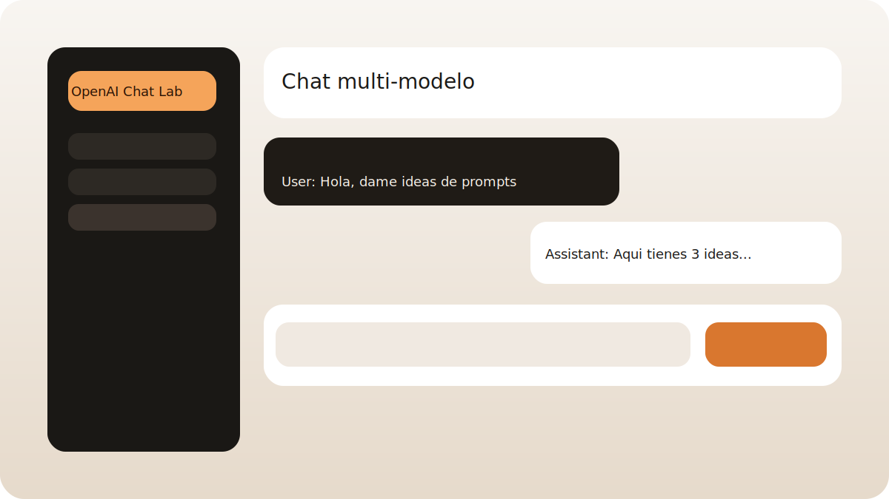
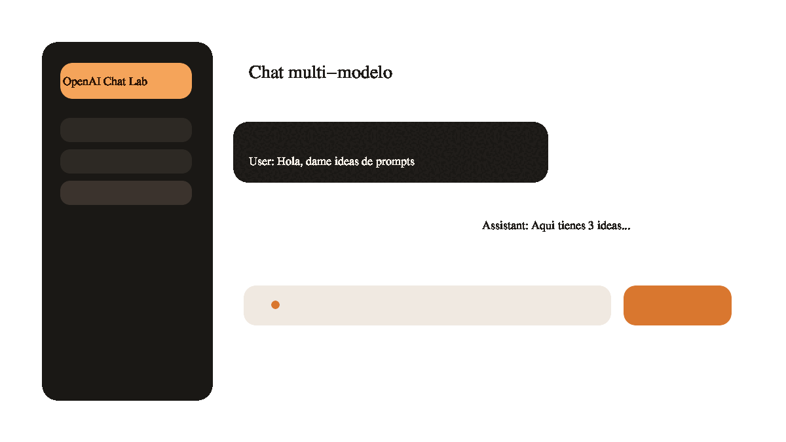

# sample-chat

Ejemplo para un video de YouTube. App web con chat multi-modelo de OpenAI, historial de conversaciones y titulos generados por IA.





## Requisitos

- Node.js 18+
- API keys de proveedores (al menos una)

### Proveedores soportados

- OpenAI: `OPENAI_API_KEY`
- Anthropic: `ANTHROPIC_API_KEY`
- Google Gemini: `GEMINI_API_KEY`
- Mistral: `MISTRAL_API_KEY`
- Meta (via endpoint compatible con OpenAI): `META_API_BASE_URL` (ej: `https://api.tu-proveedor.com`) y `META_API_KEY`

## Modo demo (sin API key)

Si no hay ninguna API key, la app pide usuario y password para entrar en modo demo.
Por defecto usa:

- Usuario: `demo`
- Password: `demo`

Puedes cambiarlos con `DEMO_USER` y `DEMO_PASS`.

## Instalacion

```bash
npm install
```

## Ejecucion

```bash
OPENAI_API_KEY=tu_key npm start
```

Abre `http://localhost:10000`.

## Estructura

- `server.js`: API y servidor Express.
- `public/`: frontend estatico.
